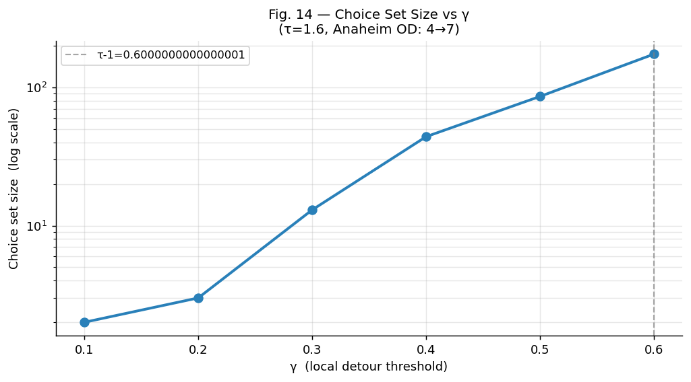
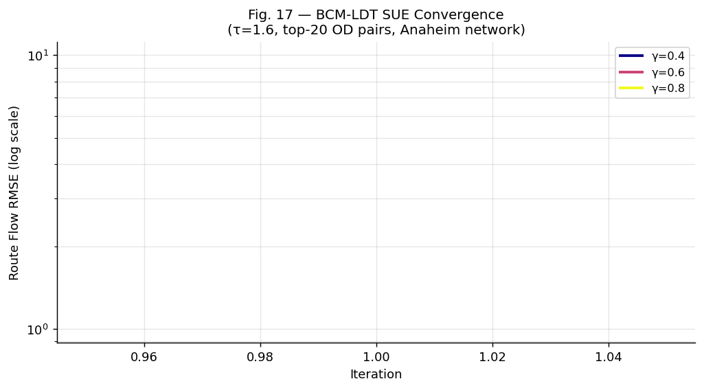
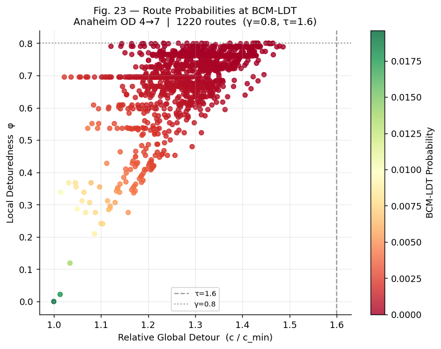
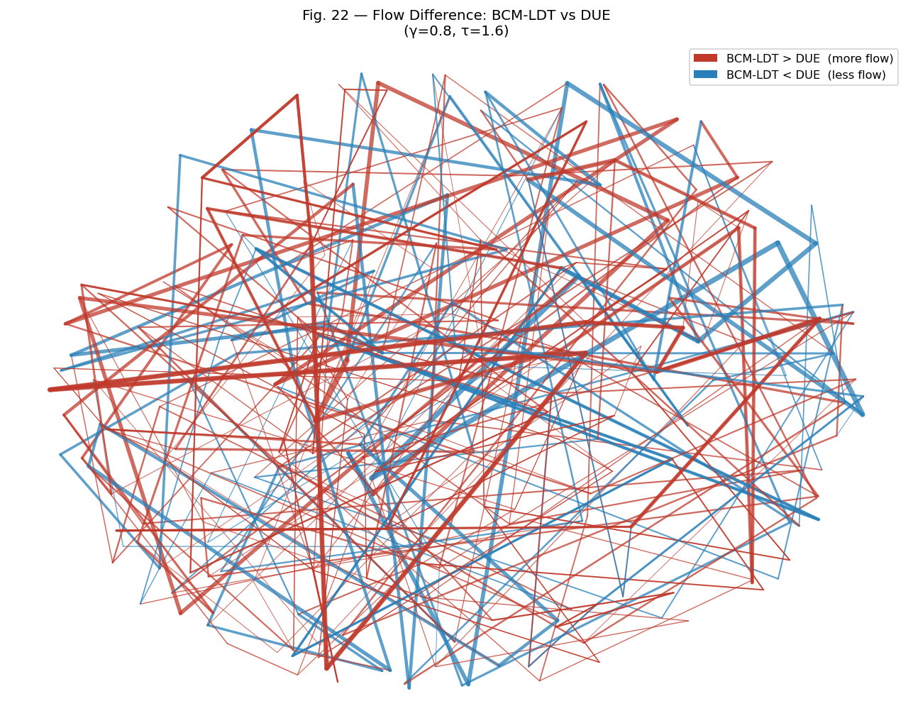

# BCM-LDT Route Choice Model — Python Implementation

Implementation of *"Local Detouredness: A New Phenomenon for Modelling Route Choice and Traffic Assignment"* — Rasmussen et al., Transportation Research Part B, 2024.

## Network
- Anaheim, California (1992)
- 416 nodes · 914 links · 1,406 OD pairs · 104,694 vehicles

## Results

### Choice Set Size vs γ (Fig. 14)


### SUE Convergence (Fig. 17)


### Route Probability Scatter (Fig. 23)


### Flow Difference BCM-LDT vs DUE (Fig. 22)


## How to Run
```bash
pip install -r requirements.txt
python src/experiments.py
python src/run_all_anaheim.py
```

## Authors
Krishna Nagamwad · Vaisakh T
Course: Behavioural Travel Modelling · Prof. Sangram Nirmale
